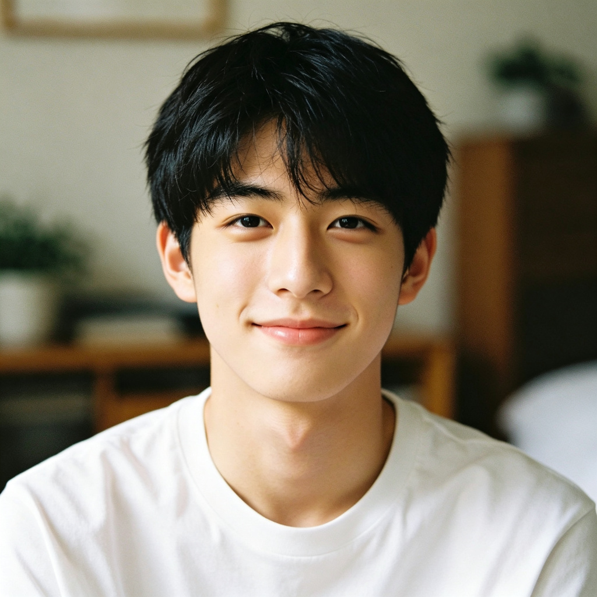
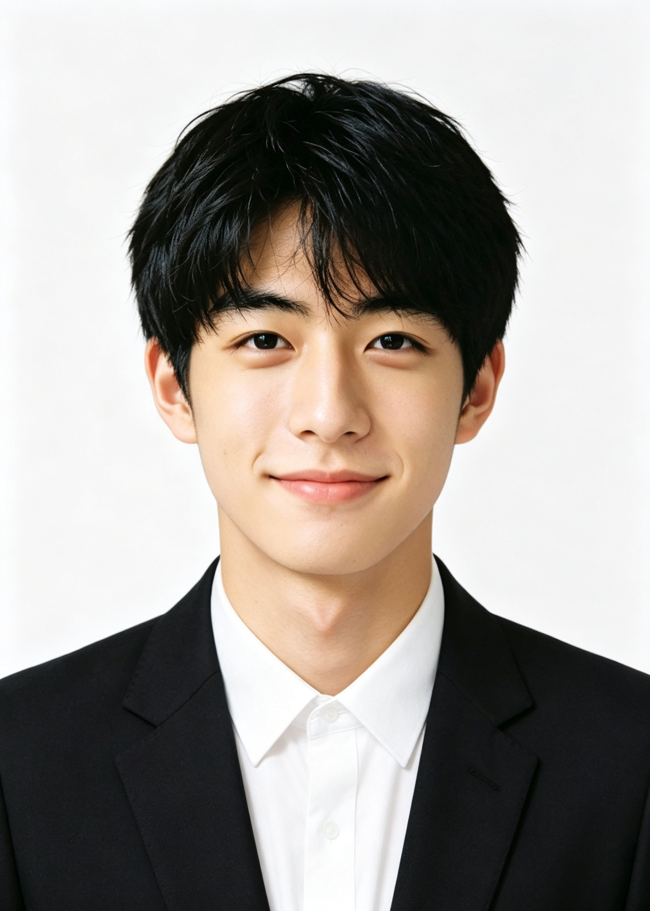
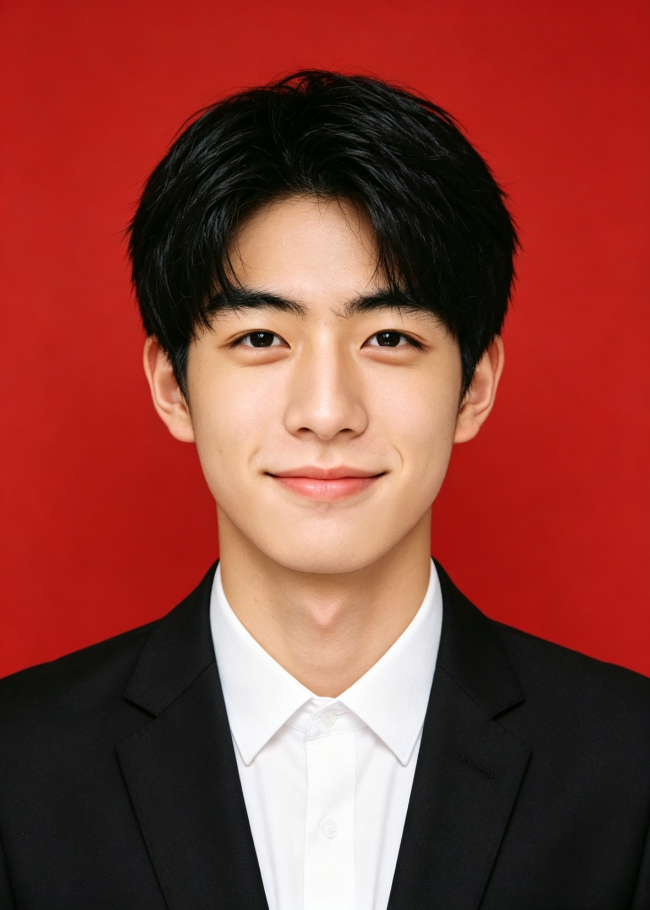
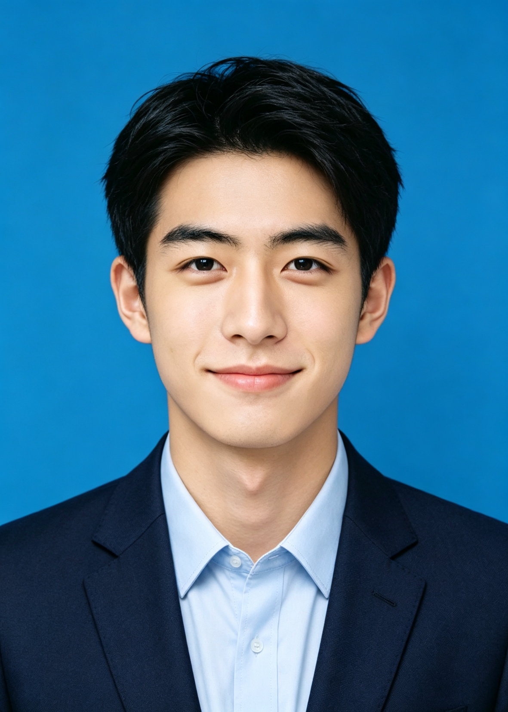
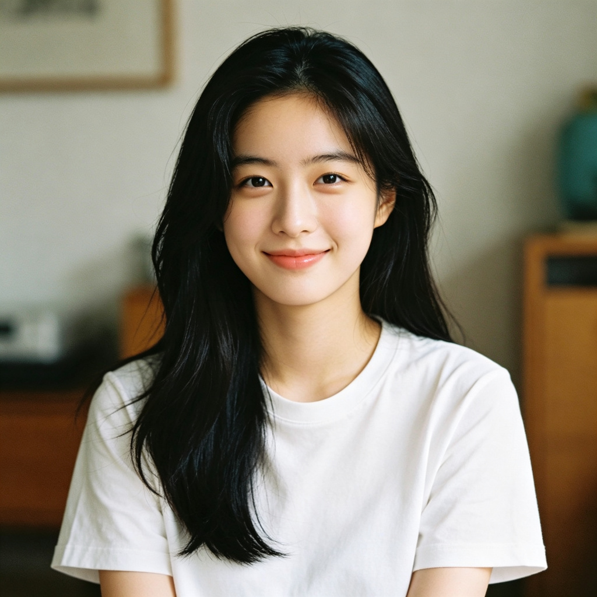
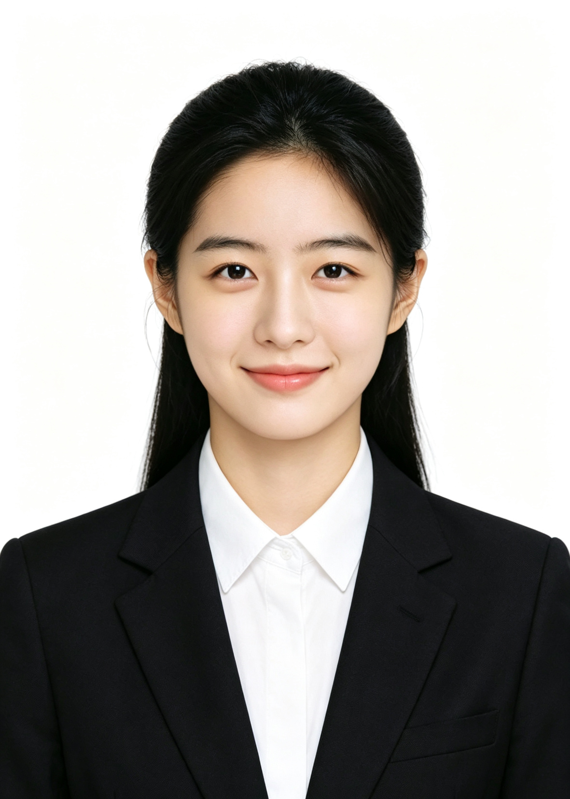
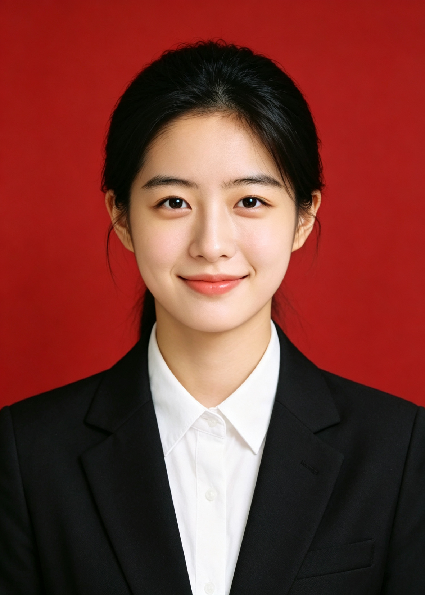
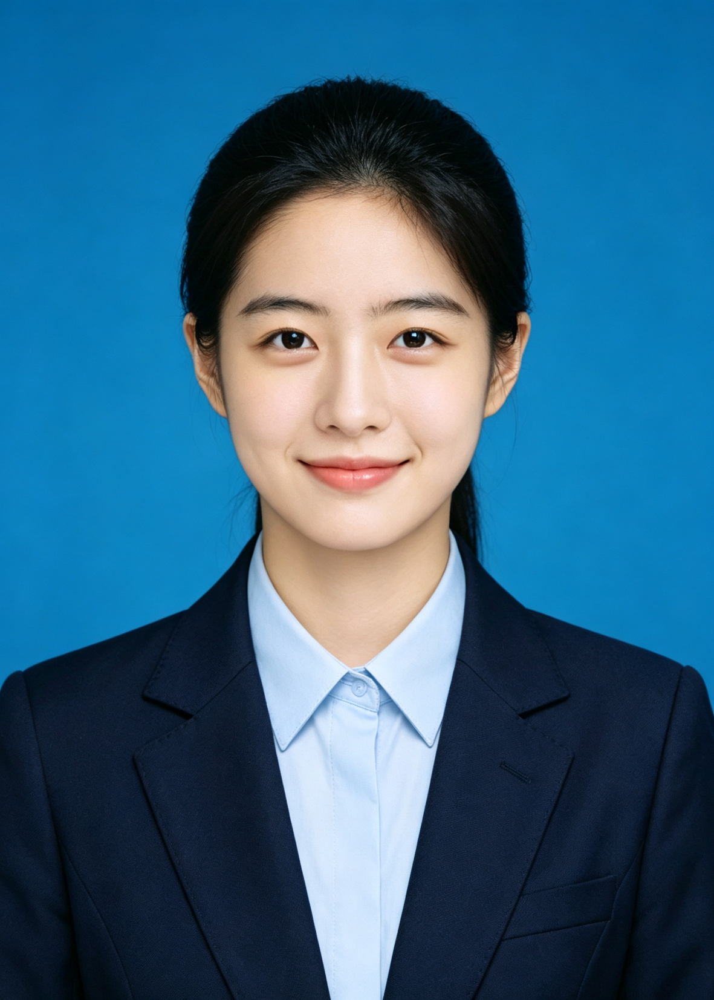

# AI ID Photo Studio · AI 证件照工作室

[](https://github.com/koi-lee/ai-id-photo-studio/actions/workflows/ci.yml)
[](LICENSE)
[](https://www.python.org/)
[](skill/SKILL.md)

> 用一个 Agent 技能，把日常自拍变成**合规、清晰、可交付**的中国标准证件照。
>
> Turn a casual selfie into a **compliant, sharp, print-ready** Chinese ID photo — with one agent skill.

[English](#english) ｜ 中文

---

## 这个项目解决什么问题

做证件照人人都会遇到，但真正难的不是"生成一张白底照"，而是：

- 生成的图**只有几百 K**，放大一看全是糊的；
- 尺寸写成 295×413，报名系统要的是 1181×1653；
- 白衬衫配白底，人像浮在半空；
- 换了衣服但**脸变了**，政务系统不认；
- 鼻子左右不对称，而**修图软件一开就磨皮**；
- 结婚证背景色不对、横竖版搞反，白跑一趟民政局。

本项目把这些坑一条条踩过、写进技能，做成一个可复用的工作流。

## 效果示例

示例为 **AI 生成模特**（非真人），展示从原片到各底色成片的完整流程：

<table>
<tr>
  <th align="center">输入原片</th>
  <th align="center">白底</th>
  <th align="center">红底</th>
  <th align="center">蓝底</th>
</tr>
<tr>
  <td align="center"></td>
  <td align="center"></td>
  <td align="center"></td>
  <td align="center"></td>
</tr>
<tr>
  <td align="center"></td>
  <td align="center"></td>
  <td align="center"></td>
  <td align="center"></td>
</tr>
</table>

## 三个核心能力

### 1. 多通道生图编排，额度断了能续跑

同一张底图，按需求走不同通道：

| 需求 | 通道 | 特点 |
|---|---|---|
| 换底色 / 换服装 / 换发型 / 整体重制 | 第三方图生图 API（如美图设计室 CLI） | 与底图一致度高、无 AI 水印，但消耗额度 |
| 快速试一版 / 无 CLI 环境 | 宿主内置生图能力 | 开箱即用，输出可能带水印需后处理 |
| **只改某处五官、要求不磨皮** | **本地几何液化**（不出本机） | 纹理 100% 保留，不重绘整脸 |

额度耗尽不是死路：把任务断点、房间 ID、续跑命令完整记录下来，充值后 `resume` 续跑，**不重建房间、不重复扣费**。

### 2. 客观画质方法论，而不是"看着还行"

- **文件体积 ≠ 清晰度**。实测过：369 KB 的图比 411 KB 的更锐。
- 用 **Laplacian 方差 + 边缘梯度**测量，统一缩放到同宽再比，避免分辨率差异干扰。
- 用户说"不清晰"时，先查**源图分辨率**找根因 —— 最常见的坑是生图 prompt 没写分辨率要求，模型只给 800×1120，再放大到 1181×1653 必然虚。
- **源图不够大就不出"超清版"**，那是假细节。

### 3. 局部修图不靠"磨皮"

要改鼻翼高低、调整对称性，生成式修图只会整脸重绘（磨皮 + 瘦脸 + 提亮），目标部位几乎不变。本项目用 `cv2.remap` 高斯液化做局部形变：

```bash
# ① 先量：测出左右高度差 Δ
python scripts/nose_liquify.py --image 成片.jpg --measure
# ② 出多档对比条，一次让用户挑档（不要逐档来回问）
python scripts/nose_liquify.py --image 成片.jpg --ladder 2,4,6,8 --strip 对比条.png
# ③ 定稿并复测
python scripts/nose_liquify.py --image 成片.jpg --auto --out 修正.png
```

**为什么值得单独做**：官方同类技能里写着"毫米级微调 AI 做不了，建议手动修图"—— 液化法解决了它。

## 支持的规格

| 规格 | 尺寸 | 宽高比 | 300dpi | 高清档 | 常用场景 |
|---|---|---|---|---|---|
| 小一寸 | 22×32 mm | 0.688 | 260×378 | 1040×1512 | 社保卡、体检表 |
| **一寸** | 25×35 mm | 0.714 | 295×413 | **1181×1653** | 驾照、简历、上岗证 |
| 大一寸 | 33×48 mm | 0.688 | 390×567 | 1560×2268 | 护照、港澳通行证 |
| 小二寸 | 35×45 mm | 0.778 | 413×531 | 1652×2124 | 毕业证、资格证 |
| 二寸 | 35×49 mm | 0.714 | 413×579 | 1652×2316 | 一般证件照 |
| 大二寸 | 35×53 mm | 0.660 | 413×630 | 1652×2520 | 出国签证 |
| 驾照 | 22×32 mm | 0.688 | 260×378 | 1040×1512 | 驾驶证 |
| 结婚证合影 | 53×35 mm（横版） | 1.514 | 626×413 | 2504×1652 | 结婚登记 |

背景色：白 `#FFFFFF` ｜ 蓝 `#438EDB` ｜ 红 `#D9001B`

> ⚠️ **默认输出高清档，不要把 300dpi 档当成品。** 295×413 只有 12 万像素，屏幕一放大就糊。300dpi 档只在报名系统强制要求时另存子目录。

## 快速上手

```bash
# 1) 隔离环境装依赖（不要全局 pip install）
python3 -m venv ~/.venvs/idphoto
~/.venvs/idphoto/bin/pip install -r requirements.txt

# 2) 后处理：按规格裁切 + 缩放 + 自适应锐化 + 输出高清 JPEG
~/.venvs/idphoto/bin/python skill/scripts/process_id_photo.py 生成的图.png \
  --spec 1inch --outdir ./output -n 一寸白底_黑色衬衫_经典正式

# 3) 一键出三档（各档自动分目录，不会互相覆盖）
~/.venvs/idphoto/bin/python skill/scripts/process_id_photo.py 生成的图.png \
  --spec 1inch --outdir ./output --tiers hd,std,uhd -n 一寸白底_黑色衬衫_经典正式
```

`--spec` 可选值：`small-1inch` · `driving-license` · `1inch`（默认）· `large-1inch` · `small-2inch` · `2inch` · `large-2inch` · `marriage`

📖 **[全部可运行示例 →](docs/usage-examples.md)** —— 每条命令都能用仓库自带的 `examples/` 直接复现，**不需要任何 API 额度**（后处理与液化全程本地运行）。

先验证环境是否就绪：

```bash
~/.venvs/idphoto/bin/python skill/scripts/selfcheck.py
# → 全部通过（24 项 = 8 种规格 × 3 个档位）
```

### 安装为技能

把 `skill/` 目录整体拷贝到你的 agent 技能目录即可 —— SKILL.md 自洽、references 相对路径正确：

| 平台 | 技能目录 |
|---|---|
| 通用 / Claude Code | `~/.claude/skills/<skill-name>/` 或项目内 `.claude/skills/` |
| WorkBuddy | `~/.workbuddy/skills/<skill-name>/` 或项目内 `.workbuddy/skills/` |

技能本体是**平台无关**的：主文件把"生图"抽象为通道选择，平台细节下沉到 `references/platform-*.md`。

脚本的尺寸与 DPI 校验由 CI 在 **Linux / macOS / Windows × Python 3.10 / 3.13** 六种组合上自动回归（状态见顶部 CI 徽章）。
终端编码也做了兜底：在英文 Windows（cp1252）、`LANG=C` 的 Linux（ascii）以及中文 Windows（GBK）下打印中文与符号都不会崩溃 —— 这三条正是把脚本分享给别人时最常见的"在我这能跑"翻车点。

## 仓库结构

```
ai-id-photo-studio/
├── skill/                    ← 融合后的技能本体，可直接装用
│   ├── SKILL.md              ← 平台无关的完整工作流（七条铁律 + 六阶段）
│   ├── references/           ← specs 规格库 · wardrobe 服装库 · hairstyles 发型库
│   │                            prompts 模板 · quality 画质 · platform-* 通道 · liquify 液化
│   ├── scripts/              ← process_id_photo 后处理 · nose_liquify 液化微调 · selfcheck 规格自检
│   └── assets/               ← 人脸关键点模型（MediaPipe Face Landmarker）
├── examples/                 ← AI 生成模特示例（male / female 各 5 张）
├── requirements.txt          ← 运行依赖（Pillow / numpy / opencv-python）
├── .github/workflows/ci.yml  ← 跨平台 CI（Linux / macOS / Windows 矩阵）
└── docs/
    ├── workflow.md           ← 端到端标准作业流程（含合规边界）
    ├── usage-examples.md     ← 全部可运行示例（无需额度即可复现）
    └── roadmap.md            ← 规格与功能 Roadmap
```

> 操作细节见 [`docs/workflow.md`](docs/workflow.md) ｜ 可跑的命令见 [`docs/usage-examples.md`](docs/usage-examples.md) ｜ 规划见 [`docs/roadmap.md`](docs/roadmap.md)

## 隐私声明

- **本仓库不含任何真人照片。** 全部示例图由 AI 生成，仅用于展示流程。
- 实际使用时请注意：**人脸图片会被发送至你所选用的第三方生图 API** 进行处理。若你处理的是他人照片，请先取得授权。
- 涉及生物识别特征的成片不要公开上传到公开仓库 —— 本仓库的 `.gitignore` 已默认屏蔽全部图片类型，仅放行 `examples/`。

## 合规提醒（重要）

生成的证件照**能否被受理，取决于办理机关**。本项目只负责技术实现，不保证过审：

- 政务系统通常要求**真实拍摄的原始影像**，部分系统会做人脸比对与合成检测。
- **结婚证合影**：《婚姻登记工作规范》要求双方"同一时间、同一地点共同拍摄"的合影，**不能使用合成照片**。AI 生成的双人合影建议只用于预览风格或情侣写真；正式登记请实拍，AI 仅用于底色替换与轻度修饰。
- 请以当地办理机关的最新要求为准。

## Roadmap

- [x] 1 寸 / 2 寸 / 多底色 / 男女服装与发型库
- [x] 局部几何液化微调（不磨皮）
- [x] 结婚证合影规格（红底横版 53:35）
- [ ] 六寸排版打印（一版多张，便于冲印）
- [ ] 护照 / 签证专用规格校验
- [ ] 合规自检脚本（底色纯净度、头部占比、文件大小上限）

## 致谢

本项目的思路来自对以下优秀开源工作的学习，在此致谢并明确差异：

- **[HivisionIDPhotos](https://github.com/Zeyi-Lin/HivisionIDPhotos)** —— 本地推理路线的标杆（抠图 / 换底 / 裁剪 / 排版），Apache-2.0。本项目的生态位不同：我们做的是 **agent 技能层的多通道编排 + 后处理管线的实战经验沉淀**，而非重写推理算法。
- **[meitu/meitu-skills](https://github.com/meitu/meitu-skills)** —— 美图官方 agent skill（MIT），其 **face_desc 面部特征锚定**与**着装冲突规则**（如身份证规格 + 白色上衣 → 强制换深色）已借鉴并写入本项目的 prompt 与服装库。我们与其底层通道同源，差异在于补充了整套**本地后处理脚本、客观画质测量法与局部液化微调**。

## License

[MIT](LICENSE)

---

<h2 id="english">English</h2>

**AI ID Photo Studio** is an agent skill that turns an everyday selfie into a compliant, sharp, print-ready Chinese ID photo.

**What makes it different:**

- **Multi-channel orchestration** — route each job to the right image model (third-party image-to-image API for full restyle, host built-in generation for quick drafts, *local* geometric liquify for surgical fixes that must not smooth skin). Interrupted jobs resume from a saved breakpoint instead of re-spending credits.
- **Objective quality methodology** — file size is not sharpness. We measure Laplacian variance and edge gradients at normalised width, and always trace "looks blurry" back to the *source image resolution* rather than blindly upscaling.
- **Surgical retouching without skin smoothing** — `cv2.remap` Gaussian liquify changes feature geometry while keeping 100% of the original skin texture.
- **Chinese government-compliance knowledge** — verified specs for 1-inch through marriage-certificate photos, official background colour values, and real-world pitfalls collected from actual submissions.

**Specs supported:** 22×32 to 35×53 mm, including the horizontal 53×35 mm marriage-certificate format, in white / blue / red backgrounds.

> ⚠️ **Compliance notice:** whether a generated photo is accepted is decided by the issuing authority. Marriage registration explicitly requires a photo taken *together, on site* — AI composites are for preview only. Always check your local authority's latest requirements.

**Privacy:** this repository contains **no real human photos**. All examples are AI-generated. Photos you process may be sent to the third-party generation API of your choice.
