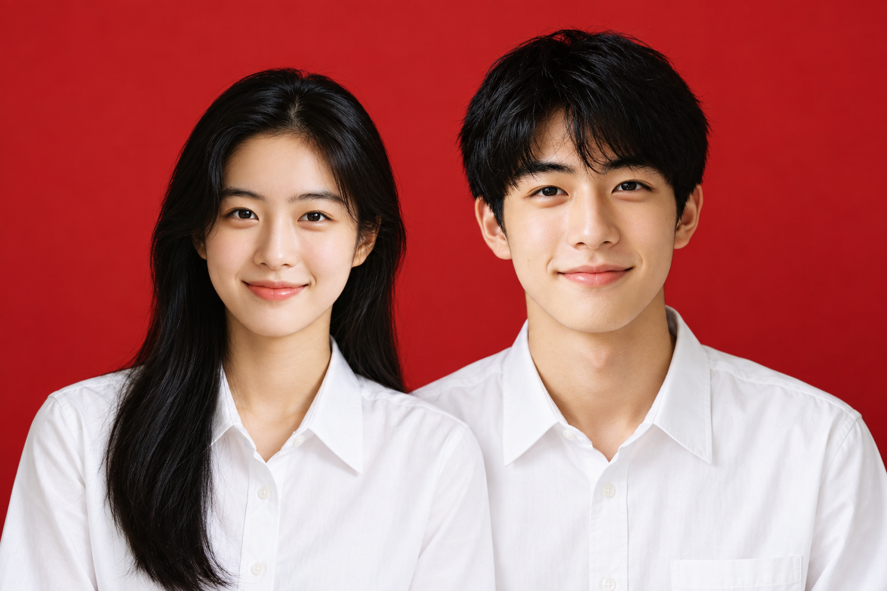

# AI ID Photo Studio · AI 證件照工作室

[简体中文](README.md) · [English](README.md#english) · 繁體中文 · [日本語](README.ja.md) · [한국어](README.ko.md)

開源 Agent 技能，結合 AI 換裝、換髮型、背景替換與 Python 本機影像後製。這是一套技能及工具，不是獨立的線上證件照網站。

## 可以做什麼

- 透過影像生成服務製作服裝、髮型與背景預覽。
- 雙人合照搭配：雙白襯衫、黑西裝、淺灰西裝、新中式、藍白襯衫。
- 在本機裁切、調整尺寸及輸出不同大小的圖片。
- 提供臉部局部形變工具，以及畫質、非目標區域與版本歸檔的檢查流程。



[查看五款示例與限制](examples/couple/README.md)（簡體中文）。人物由 AI 生成，並非真實夫妻照片；雙人示例使用內建生圖工具製作，不是倉庫腳本生成能力的實測證明。

## 規格與使用限制

目前以中國大陸常用照片尺寸預設為主，**未提供臺灣、香港、日本或韓國官方證件的專用合規驗證**。繁體中文文件不代表新增上述地區的規格支援。

不保證本人相似度或受理通過。正式用途請依辦理機關最新要求準備照片；AI 合成雙人照僅供風格預覽。

## 本機試用

準備 Python 3.10 以上，在倉庫根目錄執行：

```bash
python3 -m venv .venv
source .venv/bin/activate
python -m pip install -r requirements.txt
python skill/scripts/process_id_photo.py examples/male/base-portrait.jpg --spec 1inch --outdir output/demo --no-watermark
```

Windows 改用 `.venv\Scripts\activate` 啟用環境。此範例只處理現有圖片，不會執行 AI 換裝。

若要作為技能使用，將 `skill/` 整個資料夾複製到所用 Agent 的技能目錄。[執行範例](docs/usage-examples.md)與[技能本文](skill/SKILL.md)目前為簡體中文。

## 費用與隱私

程式碼採用 [MIT 授權](LICENSE)。本機後製不需要生圖額度；選用的影像生成服務可能另外收費。本機工具不傳送照片，遠端生成則會將輸入交給該服務。私人原片及衍生圖不得放進公開倉庫。

這是專案概要與入門文件的繁體中文版，不代表全部技術文件已翻譯。
